# Hackathon-2026-equipe-6
# Holberton x Bordeaux Métropole
----

📊Flowchart

```mermaid
flowchart LR

  subgraph PROB["Défi territorial"]
    direction TB
    P1(["Bordeaux Métropole\n28 communes · 831 534 hab."])
    P2(["46% exposés\nà 3+ aléas climatiques"])
    P3(["Plan de résilience\nadopté juin 2025"])
    P1 --> P2 --> P3
  end

  subgraph SRC["Sources de données ouvertes"]
    direction TB
    DB1[("DataHub BM\n547 jeux")]
    DB2[("IPCC AR6 2021")]
    DB3[("DRIAS 2020\nMétéo-France")]
    DB4[("Géorisques\nBRGM · IGN")]
    DB5[("INSEE")]
  end

  subgraph ENG["Moteur d'analyse des risques"]
    direction TB
    E1["Score par aléa — 0 à 10\npar commune"]
    E2["Score composite\nmoyenne 5 aléas"]
    E3["Sensibilité IPCC\n+4% à +20% par °C"]
    E4["Projection linéaire\n2025 → 2100"]
    E1 --> E2 --> E3 --> E4
  end

  subgraph APP["RésilienCarte — Application web"]
    direction TB
    A1["Carte interactive\n28 communes · Leaflet.js"]
    A2["5 couches d'aléas\nfiltrage temps réel"]
    A3["Profil commune\nradar · barres · faits clés"]
    A4["Simulation 2025-2100\n3 scénarios IPCC · 5 KPIs"]
    A1 --- A2 --- A3 --- A4
  end

  subgraph SCEN["Scénarios IPCC AR6"]
    direction TB
    SC1{{"SSP1-2.6 Optimiste\n+1.3°C en 2100"}}
    SC2{{"SSP2-4.5 Modéré\n+3.0°C en 2100"}}
    SC3{{"SSP5-8.5 Pessimiste\n+5.6°C en 2100"}}
  end

  subgraph OUT["Impact & valeur ajoutée"]
    direction TB
    O1(["Aide à la décision\npour les élus"])
    O2(["Prévention ciblée\npar zone et risque"])
    O3(["Transparence citoyenne"])
  end

  PROB == contexte ==> SRC
  SRC == données ==> ENG
  ENG == calcul ==> APP
  SCEN -- intégrés dans --> A4
  APP == résultats ==> OUT
```

## Contexte

Avec l'accélération du réchauffement climatique, les risques évoluent et il devient indispensable que les autorités et les collectivités locales s'adaptent aux nouvelles menaces, et revoient les moyens de prévention mis en place en adéquation avec les impacts potentiels.  
Dans le cadre de ce hackathon, nous nous avons pris le parti de nous assurer que les refuges aménagés en cas d'urgence (inondation), seront toujours des refuges sûrs aux horizons 2030, 2040, 2050, et ce jusqu'à 2100.
Nous avons créé un outil permettant de visualiser quelles zones seront inondées, ou deviendront des îlots de chaleur dans les années à venir, et dans quelle mesure les refuges actuels seront toujours sûrs avec l'évolution de ces deux paramètres.
Nous avons pris le parti de suivre les simulations du GIEC, qui prévoit une montée des eaux de 2m d'ici à 2100.

## 🌐 Sources & Open Data
:world_map: carte de la montée des eaux en fonction des variations de températures (de +1.5°C et +3°C):
https://coastal.climatecentral.org/map/12/-0.565/44.8366/?theme=warming&map_type=multicentury_slr_comparison&basemap=roadmap&elevation_model=best_available&lockin_model=levermann_2013&refresh=true&temperature_unit=C&warming_comparison=%5B%221.5%22%2C%223.0%22%5D

:world_map: Fichier .json/.geojson pour carte des îlots de chaleur et de fraîcheur:
 https://www.pigma.org/geonetwork/srv/fre/catalog.search#/metadata/8db2195e-277c-40f4-a917-0e333cf81db8  
https://opendata.bordeaux-metropole.fr/explore/dataset/ri_icu_ifu_s/export/?disjunctive.insee&disjunctive.dimension

Fichier .json/.geojson pour carte des fontaines à eau potable sur Bordeaux:  
https://opendata.bordeaux-metropole.fr/explore/dataset/bor_fontaines_eau_potable/information/?disjunctive.etat&disjunctive.modele_fontaine

## 🎯 Enjeux et problématique

Avec l’augmentation des épisodes de canicule et des risques d’inondation, et à moyen terme la montée des eaux (prévisions à +2m d'ici 2100 d'après le GIEC) certaines zones urbaines pourraient devenir particulièrement vulnérables.

Cependant, la présence de refuges (parcs, bâtiments publics, zones sûres) ne garantit pas leur accessibilité réelle pour les habitants en cas de dégradation des conditions environnementales.

Comment identifier les refuges où le risque est élevé et où l’accès à un refuge sera limité ou impossible ?

## ⚙️ Fonctionnalités

Bordeaux Safe Place est une application web interactive qui stress-teste les refuges climatiques de la ville de Bordeaux face aux risques futurs d'inondation et de canicule. L'utilisateur visualise sur une carte quels équipements (parcs, gymnases, hôpitaux, EHPAD, lieux frais...) seront encore disponibles et fiables à l'horizon 2030, 2040 et 2050, et lesquels sont aujourd'hui menacés par les zones de risque. Le périmètre est volontairement restreint à la commune de Bordeaux pour le MVP — une extension aux 28 communes de la Métropole est prévue comme perspective d'évolution.

- 📍 Carte interactive centrée sur la ville de Bordeaux (quartiers)
- 🏥 Score de pérennité par refuge avec 3 horizons : 2026, 2030, 2040, 2050
- 🗺️ 2 couches de risque : zones inondables (PPRI) + îlots de chaleur (LCZ)
- ✅ Filtres par statut : Sûr / Menacé / Critique
- 💡 Fiche détail au clic : score, exposition, recommandation

## 🧠 Méthodologie

Le projet repose sur un croisement de données :

- données climatiques (température, zones inondables, prévisions du GIEC)
- données urbaines (parcs, infrastructures)
- données spatiales (coordonnées, distances)

## 🏗️ Architecture

## 🌍 Impact

Ce projet vise à améliorer la résilience urbaine face aux changements climatiques en mettant en évidence les zones où les habitants seront les plus vulnérables .

Il peut aider à :
- orienter les politiques publiques
- prioriser les investissements
- sensibiliser les citoyens

## 👥 Équipe

Projet réalisé dans le cadre du hackathon Holberton School.

- Julia Costa de Sousa
- Anthony Di Domenico
- Dorian Oufer
- Adele Megelink
